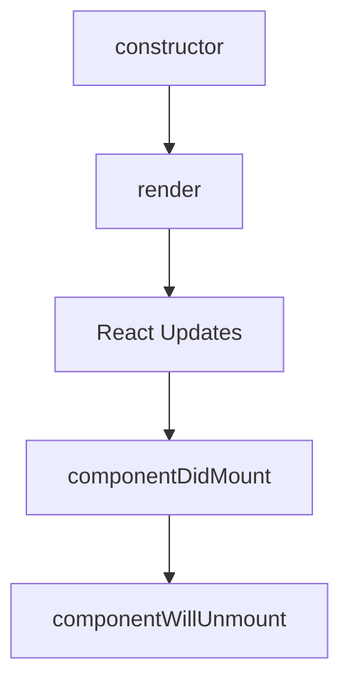

# Class 01 
## State and Props
**Lifecycle of Components**
> Each component in React has a lifecycle which you can monitor and manipulate during its three main phases. The three phases are: Mounting, Updating, and Unmounting.[1]
### React lifecycle

* what happens first, the ‘render’ or the ‘componentDidMount’?
     render

* What is the very first thing to happen in the lifecycle of React?
constructor
* Put the following things in the order that they happen: componentDidMount, render, constructor, componentWillUnmount, React Updates

* What does componentDidMount do?
It allows us to execute the React code when the component is already placed in the DOM.[2]

### React State Vs Props

* What types of things can you pass in the props?
The initial values of components could be any data type, from strings to functions, and objects.

* What is the big difference between props and state?
props are handled outside the component and must be updated outside of the component, while the state is handled inside of that component and you can be updated inside the component  

* When do we re-render our application?
when we change the state inside our application.

* What are some examples of things that we could store in state?
counter, timer

### References:
* [[1]](https://www.w3schools.com/react/react_lifecycle.asp#:~:text=Lifecycle%20of%20Components,Mounting%2C%20Updating%2C%20and%20Unmounting.) 
* [[2]](https://www.geeksforgeeks.org/reactjs-componentdidmount-method/#:~:text=The%20componentDidMount()%20method%20allows,after%20the%20component%20is%20rendered.) 