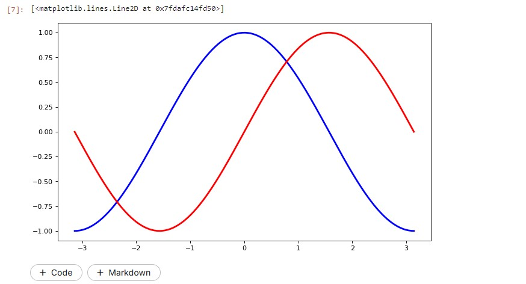
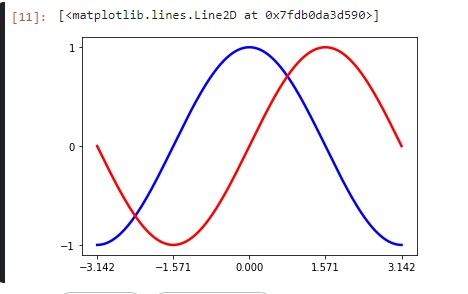
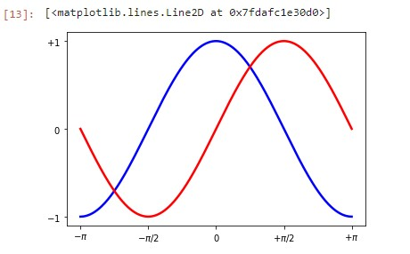
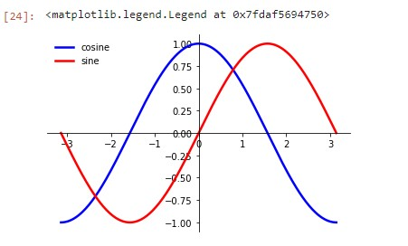
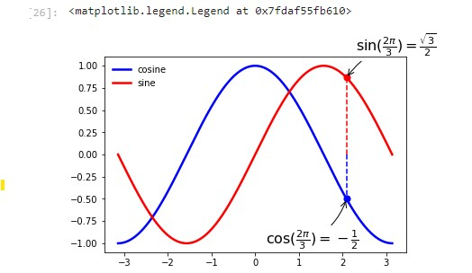

# Class-10
## Data Visualization
### Reading
##### Matplotlib Tutorial
- **Matplotlib** is a comprehensive library for creating static, animated, and interactive visualizations in Python. Matplotlib makes easy things easy and hard things possible.

- **IPython** is an enhanced interactive Python shell that has lots of interesting features including named inputs and outputs, access to shell commands, improved debugging and much more
- **pyplot** provides a convenient interface to the matplotlib object-oriented plotting library.
- Kaggel:
```python
import numpy as np 
from matplotlib import pyplot as plt

X = np.linspace(-np.pi, np.pi, 256, endpoint=True)
C, S = np.cos(X), np.sin(X)
plt.figure(figsize=(10,6), dpi=80)
plt.plot(X, C, color="blue", linewidth=2.5, linestyle="-")
plt.plot(X, S, color="red",  linewidth=2.5, linestyle="-")
```
- 
```python
## make some space in order to clearly see all data points
plt.xlim(X.min()*1.1, X.max()*1.1)
plt.ylim(C.min()*1.1, C.max()*1.1)
## Current ticks are not ideal because they do not show the interesting values (+/-π,+/-π/2) for sine and cosine. We'll change them such that they show only these values.
plt.xticks( [-np.pi, -np.pi/2, 0, np.pi/2, np.pi])
plt.yticks([-1, 0, +1])
```
- 
```python
## use π instead of 3.142
plt.xticks([-np.pi, -np.pi/2, 0, np.pi/2, np.pi],
       [r'$-\pi$', r'$-\pi/2$', r'$0$', r'$+\pi/2$', r'$+\pi$'])

plt.yticks([-1, 0, +1],
       [r'$-1$', r'$0$', r'$+1$'])
```
- 
- **Moving spines**
- **Spines** are the lines connecting the axis tick marks and noting the boundaries of the data area. They can be placed at arbitrary positions and until now, they were on the border of the axis. We'll change that since we want to have them in the middle. Since there are four of them (**top/bottom/left/right**), we'll discard the top and right by setting their color to none and we'll move the bottom and left ones to coordinate 0 in data space coordinates.
```python
ax = plt.gca()
ax.spines['right'].set_color('none')
ax.spines['top'].set_color('none')
ax.xaxis.set_ticks_position('bottom')
ax.spines['bottom'].set_position(('data',0))
ax.yaxis.set_ticks_position('left')
ax.spines['left'].set_position(('data',0))
plt.plot(X, C, color="blue", linewidth=2.5, linestyle="-", label="cosine")
plt.plot(X, S, color="red",  linewidth=2.5, linestyle="-", label="sine")
plt.legend(loc='upper left', frameon=False)
```

- **Annotate some points**

```python
t = 2*np.pi/3
plt.plot([t,t],[0,np.cos(t)], color ='blue', linewidth=1.5, linestyle="--")
plt.scatter([t,],[np.cos(t),], 50, color ='blue')

plt.annotate(r'$\sin(\frac{2\pi}{3})=\frac{\sqrt{3}}{2}$',
       xy=(t, np.sin(t)), xycoords='data',
       xytext=(+10, +30), textcoords='offset points', fontsize=16,
       arrowprops=dict(arrowstyle="->", connectionstyle="arc3,rad=.2"))

plt.plot([t,t],[0,np.sin(t)], color ='red', linewidth=1.5, linestyle="--")
plt.scatter([t,],[np.sin(t),], 50, color ='red')

plt.annotate(r'$\cos(\frac{2\pi}{3})=-\frac{1}{2}$',
       xy=(t, np.cos(t)), xycoords='data',
       xytext=(-90, -50), textcoords='offset points', fontsize=16,
       arrowprops=dict(arrowstyle="->", connectionstyle="arc3,rad=.2"))
plt.plot(X, C, color="blue", linewidth=2.5, linestyle="-", label="cosine")
plt.plot(X, S, color="red",  linewidth=2.5, linestyle="-", label="sine")

plt.legend(loc='upper left', frameon=False)
```
- 
- **Figures, Subplots, Axes and Ticks**
    - **figure** is the windows in the GUI that has "Figure #" as title. Figures are numbered starting from 1 as opposed to the normal Python way starting from 0. 
    - **subplots** create a figure and a grid of subplots with a single call while providing reasonable control over how the individual plots are created.
    - **Axes** are very similar to subplots but allow placement of plots at any location in the figure. So if we want to put a smaller plot inside a bigger one we do so with axes.
    - **Ticks** are the values used to show specific points on the coordinate axis. It can be a number or a string. Whenever we plot a graph, the axes adjust and take the default ticks
- **Animation**
package has a great class that can be used to create great live charts and animations called FuncAnimation.
