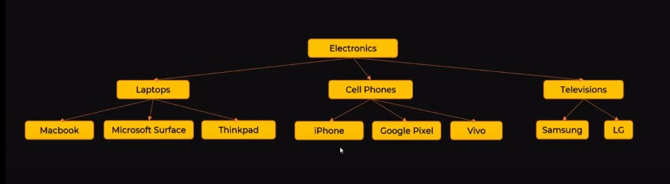
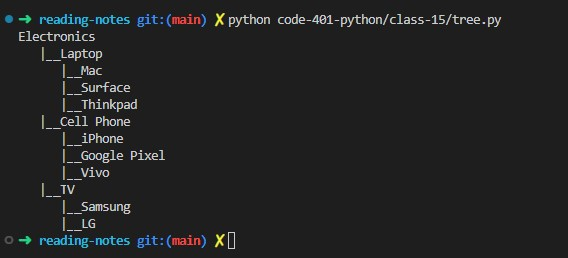

# Class-15
## Tree Implementation
### Reading
##### Tree
- A **tree** is non-linear and a hierarchical data structure consisting of a collection of nodes such that each node of the tree stores a value and a list of references to other nodes (the “children”).
- **Basic terminology of the tree**
    1. **Root node**: The topmost node in the tree is known as the root node. The whole tree is referenced through the root node.
    2. **Edge**: Edge is linked between the two nodes.
    3. **Leaf node**: A leaf node is a node that has no child node.
    4. **Parent node**: A parent-node can have multiple child nodes.
    5. **Child node**: A child has only one parent node.
    6. **Path**: The path is a set of successive edges from the initial node to the terminal node.
- 
- **Types of Tree**
    - **Binary Tree**
        - In the data structure, a binary tree is such type of tree in which each node has only a maximum of two children. Those are called the left child and right child.
        - 
    - **Binary Search Tree**
        - A binary search tree is a type of tree in which every node is organized in the sorted order. It is also called an ordered binary tree.
        - 
    - **AVL Tree**
        - AVL tree is a binary search tree in which the difference of heights of left and right subtrees of any node is less than or equal to one.
        - 
    - **B-Tree** 
        - A B-tree is an M-Way (multi-way) tree that is specially designed for use in the disk. An M-way tree can have many children. A node in an M-way tree can have many keys. If the number of keys in a node of the M-way tree is N,  the number of children in that node will be k + 1.
        - 

- **PYTHON Example**:
    
    ```python 
    class TreeNode:
        def __init__(self, data):
            self.data = data
            self.children = []
            self.parent = None

        def get_level(self):
            level = 0
            p = self.parent
            while p:
                level += 1
                p = p.parent

            return level

        def print_tree(self):
            spaces = ' ' * self.get_level() * 3
            prefix = spaces + "|__" if self.parent else ""
            print(prefix + self.data)
            if self.children:
                for child in self.children:
                    child.print_tree()

        def add_child(self, child):
            child.parent = self
            self.children.append(child)

    def build_product_tree():
        root = TreeNode("Electronics")

        laptop = TreeNode("Laptop")
        laptop.add_child(TreeNode("Mac"))
        laptop.add_child(TreeNode("Surface"))
        laptop.add_child(TreeNode("Thinkpad"))

        cellphone = TreeNode("Cell Phone")
        cellphone.add_child(TreeNode("iPhone"))
        cellphone.add_child(TreeNode("Google Pixel"))
        cellphone.add_child(TreeNode("Vivo"))

        tv = TreeNode("TV")
        tv.add_child(TreeNode("Samsung"))
        tv.add_child(TreeNode("LG"))

        root.add_child(laptop)
        root.add_child(cellphone)
        root.add_child(tv)

        root.print_tree()

    if __name__ == '__main__':
        build_product_tree()
    ```
    